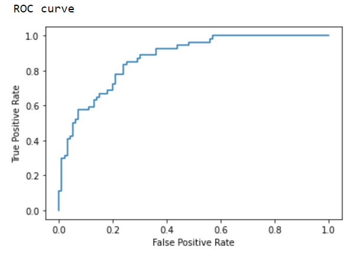

# Weighted Average Ensemble of DNN Models

We developed a weighted average ensemble using deep neural network models
on the diabetes dataset found on [kaggle](https://www.kaggle.com/c/diabetes/data).

We divided the dataset into two by features and built two DNN models using the seperate datasets. We then weighted and averaged the models predictions.
We applied a GridSearch on a set of pre-defined weights and found optimal weight pair to be [0.4, 0.6], which produced prediction accuracy of 79.22%, AUC of 0.871 and shown a  promising ROC. 

